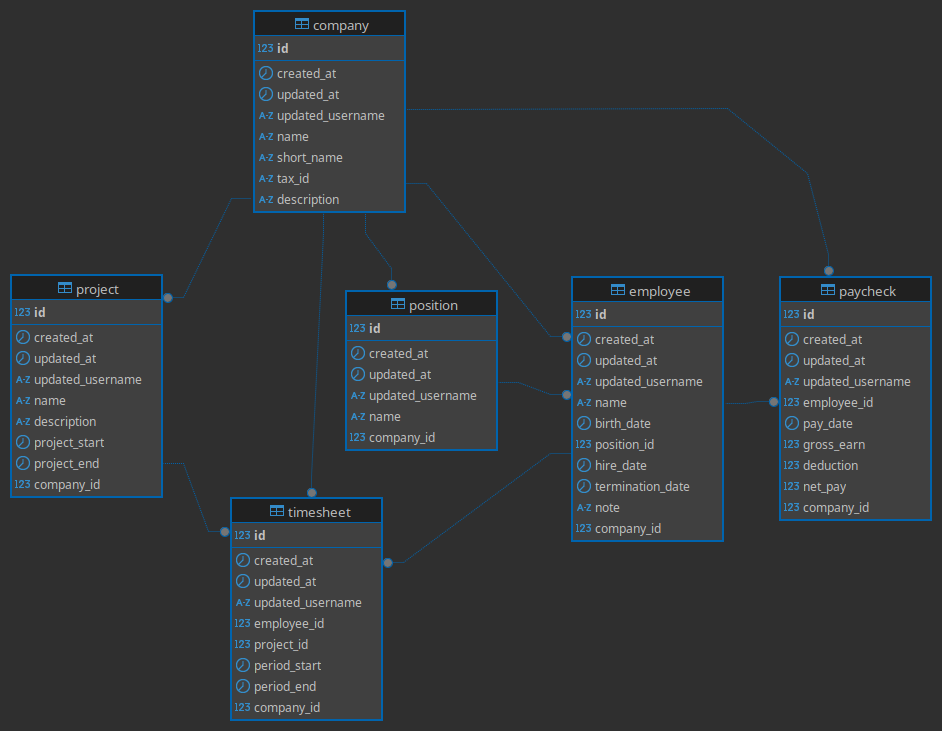

[to go back](/resource/README.md)

# Database Solution
This is a robust and efficient database solution designed to manage human resources for client companies. The solution provides a centralized repository for storing employee and project information, ensuring data consistency and integrity. With a focus on business rules and validation, this database ensures that only accurate and reliable data is entered, minimizing errors and manual corrections.

## Business Vision
The database solution presented here is designed to meet the needs of multiple clients in a B2B (Business-to-Business) solution. The solution provides a centralized repository for storing employee and project information, and offers insights and reports to help clients manage their workforce and projects more effectively.

### Key Benefits
* **Multi-client support**: The solution is designed to support multiple clients, allowing each client to manage their own employees and projects.
* **Insights and reports**: The solution provides a range of insights and reports, including:
	+ Amount allocated per project
	+ Hours launched in a given project
	+ Cost per employee
	+ Cost per project
	+ And many others
* **Customizable**: The solution is highly customizable, allowing clients to tailor it to their specific needs.
* **Scalable**: The solution is designed to be modular and scalable, making it easy to integrate with other services and systems.

### Data Model
The data model presented here consists of the following tables:

* **Employees**: stores information about employees, including name, position, hire date, and termination date.
* **Projects**: stores information about projects, including name, description, start date, and end date.
* **Timesheets**: stores information about employee hours worked on projects, including time start, time end, and relation on employee and project.
* **Paychecks**: stores information about employee paychecks, including date, gross earnings, deductions, and net pay.
* **Companies**: stores information about client companies, including name, short name, description and taxId.

The data model also includes several key relationships between tables, including:

* **Project-Timesheet**: each project can have multiple timesheets associated with it.
* **Employee-Paycheck**: each employee can have multiple paychecks associated with them.
* **Company-all**: all tables are associated with company.

Here is the block explaining the triggers and the advantages of this approach from a business perspective:

### Triggers and Validations
The schema includes a set of triggers and functions that validate data and ensure consistency. These triggers include:

* **Trigger for validating employee hours**: prevents hours from being released in a project before an employee's hire date or after their termination date.
* **Trigger for validating project hours**: prevents hours from being released in a project before its start date or after its end date.
* **Trigger for validating timesheet updates**: prevents timesheet updates if hours were released outside the project's current interval after a project's date update.

### Benefits of Bringing Business Rules to the Database
By integrating business rules and validation into the database, we can achieve numerous benefits, including:

* **Data Consistency**: Ensures that data is accurate and consistent across all records and fields.
* **Data Validation**: Prevents incorrect or invalid data from being entered, reducing errors and manual corrections.
* **Improved Data Quality**: Ensures that data is reliable and trustworthy, making it easier to extract insights and reports.
* **Reduced Data Errors**: Minimizes the risk of data errors, ensuring that business decisions are based on accurate information.
* **Increased Efficiency**: Automates data validation and consistency checks, streamlining the data entry process.

### Why Bring Business Rules to the Database?

In traditional database designs, business rules and validation are often implemented using application code or external services. However, this approach can lead to inconsistent data, errors, and maintenance headaches. By integrating business rules and validation into the database itself, we can ensure that data quality and consistency are maintained at the core of the system.

By implementing business rules in the database, we can ensure that only valid data is entered, even by users who try to bypass the normal data entry process. This prevents data inconsistencies and ensures that the data is accurate and consistent.

> So even if the intern tries to insert data directly into the database, invalid data will not be accepted.

### Future Expansion
The data model presented here is highly scalable and can be easily expanded to include new tables and relationships. Some possible future expansions include:

* **Integration with HR systems**: integration with HR systems to automate employee data management.
* **Integration with accounting systems**: integration with accounting systems to automate financial management.
* **Reporting and analytics**: development of additional reporting and analytics capabilities to provide deeper insights into client data.

## Stored Procedures and Triggers

The database includes a set of stored procedures and triggers to simplify data insertion and update operations, and to enforce business rules and data consistency. These procedures and triggers include:

* **insert_update_employee**: inserts or updates an employee record.
* **insert_update_position**: inserts or updates a position record.
* **insert_update_project**: inserts or updates a project record.
* **insert_update_timesheet**: inserts or updates a timesheet record.
* **insert_update_paycheck**: inserts or updates a paycheck record.
* **validate_timesheet**: validates the period of a timesheet to ensure it does not overlap with other timesheets or projects.
* **validate_project_period**: validates the period of a project to ensure it does not overlap with other projects or timesheets.
* **validate_employee_period**: validates the period of an employee to ensure it does not overlap with other employees or timesheets.

## Integration with Microservices Architecture
This database solution can be integrated with a microservices architecture, where multiple services can share a common database. By following the principles of domain-driven design, we can ensure that the database is designed to meet the needs of each service, while ensuring data consistency and integrity across all services.

Some solutions in microservices projects aim to use a dedicated database for each microservice, and I believe that the resources are available to be used and the choice of a solution should make sense for the project.

In this case, I mixed the two scenarios, where the authorization server service has a dedicated database, and for the business case I decided to concentrate the business rule in a database that can be used by one or more services.

## Security Considerations
To ensure the security of the database, we recommend the following:

* **Database isolation**: The database should not be linked to the public network. Instead, it should be isolated to the internal network, where only authorized applications have access to the database.
* **Least privilege principle**: Each application accessing the database should have its own user with the necessary permissions, following the principle of least privilege. This ensures that each application can only access the data it needs to function, minimizing potential security risks.
* **API security**: APIs that access the database should not be exposed to the public network. Instead, they should be accessible only within the internal network, or through a reverse proxy.

### API Security
To secure the APIs that access the database, we recommend the following:

* **Use HTTPS**: APIs should use HTTPS to encrypt incoming and outgoing requests.
* **Use authentication and authorization**: APIs should authenticate and authorize incoming requests to ensure that only authorized applications have access.
* **Use rate limiting**: APIs should have rate limiting in place to prevent abuse and attacks.

## Conclusion
By bringing business logic into the database, we can ensure that data accuracy and consistency are maintained at the core of our system. This approach has numerous benefits, including reduced errors, improved data quality, and increased efficiency. By enforcing business rules and validation in the database itself, we can prevent incorrect or invalid data from being entered, making it easier to extract insights and make informed decisions.

In summary, integrating business rules and validation into the database is a crucial step in maintaining data accuracy and consistency. By doing so, we can ensure that our data is reliable, trustworthy, and consistent, making it easier to make informed decisions and drive business success.